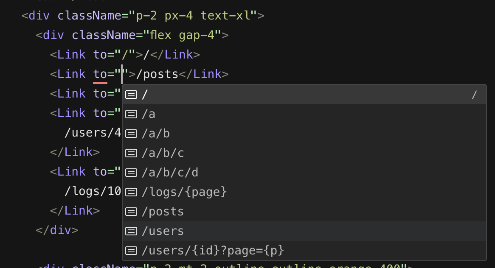

# Wayfind
Wayfind is a router with full typecheck of all router paths and variables for queries and their data types and it all works without plugins!



## Installation

```bash
npm install wayfind
yarn add wayfind
pnpm add wayfind
```
## React Installation
For react to install an additional package:
```bash
npm install wayfind-react
yarn add wayfind-react
pnpm add wayfind-react
```
## Usage
Demo: [wayfind-demo](./packages/demo/)